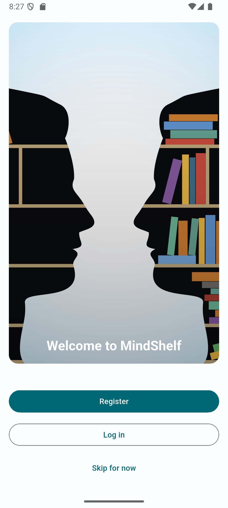
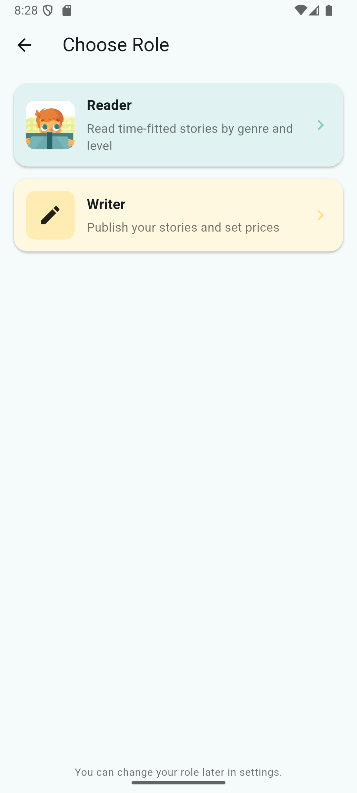
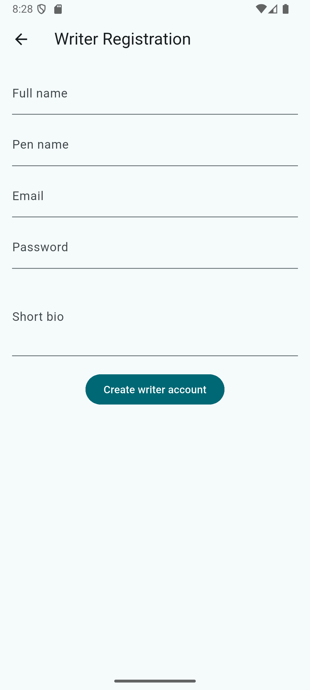
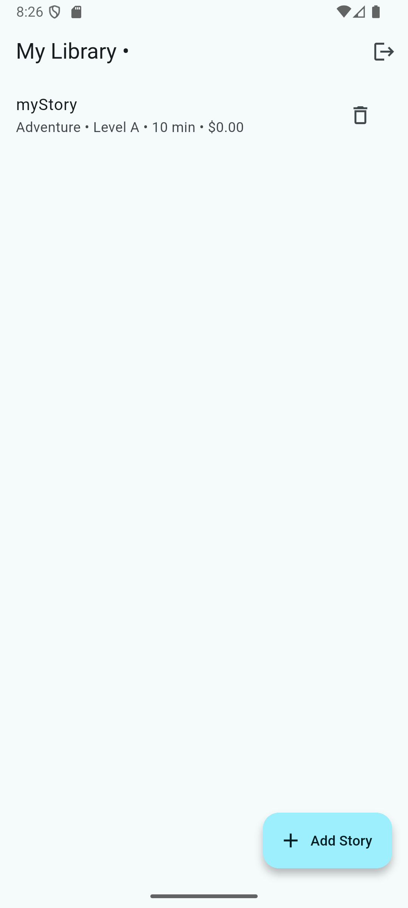
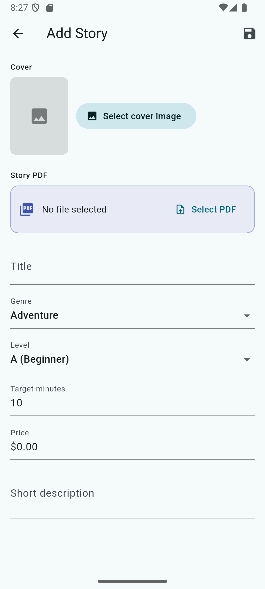

# 📚 MindShelf

MindShelf is a Flutter-based mobile application prototype designed as a digital library platform that connects readers and writers.

The application provides separate experiences for readers and writers, allowing users to explore digital content while giving writers tools to manage and publish their stories.

## ✨ Features

- Reader and Writer user roles
- User registration and login interface
- Writer dashboard
- Create and edit stories
- Digital library interface
- Responsive mobile user interface

## 🛠️ Technologies

- Flutter
- Dart
- Android Studio

## 📱 Application Preview

<p align="center">
  
  
  
  
  
</p>

## 🚀 Running the Project

1. Clone the repository.
2. Install Flutter dependencies:
   ```bash
   flutter pub get
  3- flutter run
